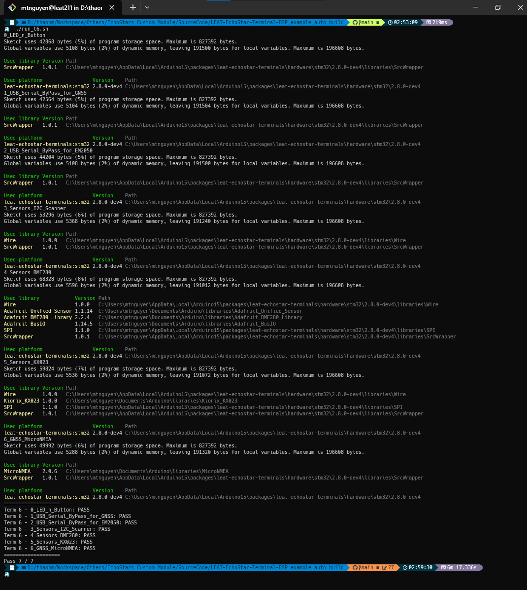

# Arduino Auto Build/Check for LEAT-EchoStar-Terminal-BSP
 
One command to build, check & export binaries for multiple Arduino sketchs!

# :question: How to use

- Make sure that everythings are working with ArduinoIDE
- Install [Arduino-CLI](https://arduino.github.io/arduino-cli/)
- Execute the `./build_*.sh` or `./build_t6.sh && ./build_t7.sh`
- Enjoy a cup of coffee ☕

# :question: How to upload the exported binaries

**The easiest way** is that you can upload them using STM32CubeProgrammer.

**The fastest & most robust way** may be copy uploading command from ArduinoIDE & replace with your binary path that you expect to upload.

# :checkered_flag: To-do

- [ ] Add build option to the script

---

###### GLHF !

:shipit: :shipit: :shipit:
